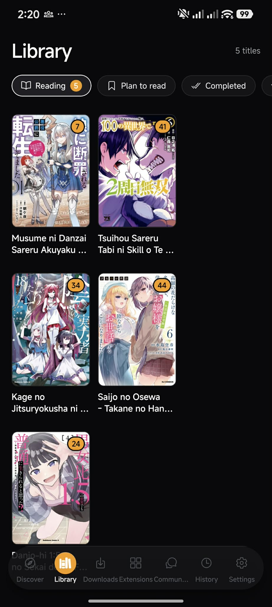
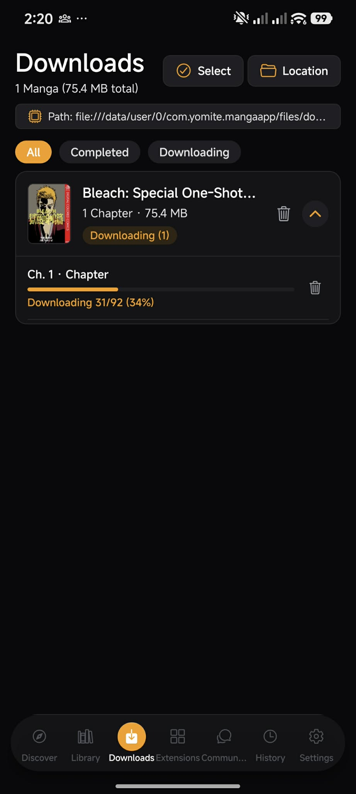
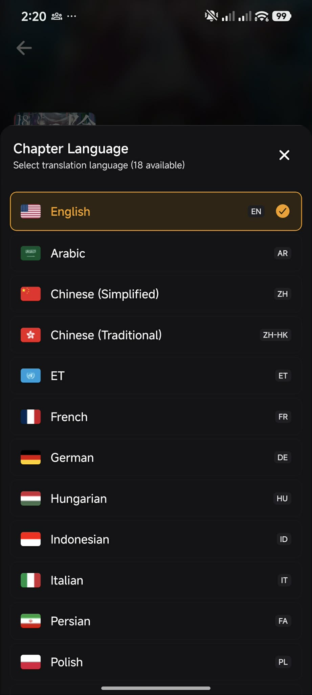

<div align="center">


# 📖 Yomite (読手)
### Modern, Ultra-Fast Universal Manga Reader for Web, Android & iOS

[](https://expo.dev/)
[](https://reactnative.dev/)
[](https://react.dev/)
[](https://www.typescriptlang.org/)
[](https://supabase.com/)
[](LICENSE)

<p align="center">
  <b>Yomite</b> is a state-of-the-art, cross-platform manga reader application built with <b>Expo Router</b>, <b>React Native Web</b>, and the <b>MangaDex API</b>. Designed with a sleek glassmorphic aesthetic, custom cubic micro-interactions, offline chapter caching, and seamless cloud synchronization.
</p>

[✨ Features](#-features) • [📱 Screenshots](#-screenshots--previews) • [🚀 Quick Start](#-getting-started) • [⚙️ Configuration](#-configuration--environment) • [📦 Building & Deployment](#-building--deployment) • [📂 Architecture](#-project-structure)

---

</div>

## 📱 Screenshots & Previews

<div align="center">

### 🌟 Core Experience & Feature Showcase

| 📖 Immersive Reader Engine | 📚 Cloud Library & Collections |
| :---: | :---: |
|  |  |
| *Continuous Webtoon, Single & Double Page spread modes* | *Organized reading categories with cross-device sync* |

<br />

| 📥 Offline Download Vault | 🌐 Global Language Translations |
| :---: | :---: |
|  |  |
| *Zero-login background downloads & cache management* | *Multi-language chapter feeds & scanlation groups* |

</div>

---

## ✨ Features

### 📖 High-Performance Reading Engine
- **Multiple Reading Modes**:
  - 📜 **Webtoon / Long Strip**: Continuous fluid vertical scrolling with smooth infinite load.
  - 📄 **Single Page**: Distraction-free page-by-page viewing with tap/swipe transitions.
  - 📑 **Double Page**: Desktop and tablet spread simulation for authentic two-page manga panels.
  - 🔁 **Direction Switching**: Left-to-Right (Western/Manhwa) and Right-to-Left (Traditional Japanese Manga).
- **Navigation & Controls**:
  - Full keyboard shortcuts on Web (`←` / `→` page flip, `Space` scroll, `F` fullscreen toggle, `Esc` exit menu).
  - Quick chapter jump drawer with scanlation group badges and release timestamps.
  - Page thumbnail slider with instant chapter progress tracking.
- **Reading Comfort**:
  - Customizable reader themes: **OLED Deep Black**, **Dark Charcoal**, **Sepia Warm**, and **Pure White**.
  - Adjustable reader brightness overlay and customizable image fit (Fit Width, Fit Height, Original).

### 🔍 Rich Discovery & Exploration
- **Dynamic Hero Spotlight**: Auto-rotating hero carousel with live dynamic backdrop blurring.
- **Instant Spotlight Search (`Ctrl + K` / `Cmd + K`)**:
  - Quick-search modal with live query suggestions, recent search history, and trending tags.
- **Advanced Filter Matrix**:
  - Filter by **Status** (Ongoing, Completed, Hiatus, Cancelled).
  - Filter by **Demographic** (Shounen, Shoujo, Seinen, Josei, None).
  - Filter by **Content Rating** (Safe, Suggestive, Erotica).
  - Multi-select genres, themes, and sort orders (Popularity, Latest, Rating, Title).

### 📥 Offline Chapter Downloads & Local Storage
- **Zero-Login Full Offline Support**: Full library and reading history preserved offline via `AsyncStorage` / `LocalStorage`.
- **Parallel Chapter Downloader**: Download entire chapters to local device storage with background progress tracking.
- **Network Resilience**: Automatic offline detection (`NetInfo`) with intelligent pulse animation prompting users to access offline downloads.

### 📚 Cloud Library & Sync
- **Custom Categorization**: Organize titles into *Reading*, *Plan to Read*, *Completed*, *On Hold*, *Dropped*, and *Favorites*.
- **Supabase Cloud Sync**: Seamless cross-device history and bookmark synchronization for signed-in accounts.
- **Library Export & Import**: Backup your entire reading list and favorites to JSON for easy migration.

### 🎨 Visual Polish & UI/UX Excellence
- **Glassmorphic Design System**: Modern dark-mode aesthetic with frosted glass headers (`expo-blur`), smooth borders, and tailored HSL color palettes.
- **Dynamic Theme Accents**: Choose from Crimson Rose (`#F43F5E`), Neon Purple (`#A855F7`), Emerald Jade (`#10B981`), Sapphire Blue (`#3B82F6`), Cyberpunk Amber (`#F59E0B`), and Sunset Orange (`#FB923C`).
- **Micro-Interactions**: Fluid spring-physics scaling (`AnimatedPressable`), staggered card entrances, and tactile haptic feedback (`expo-haptics`).

### 👥 Community & Social Sharing
- **Discussion Feed**: Community comments, chapter reviews, and reader discussions powered by Supabase.
- **Visual Share Cards**: Generate branded manga quote/recommendation cards with cover art, summary, and QR codes (`react-native-view-shot`) exported directly as images.

---

## 🛠️ Technology Stack

| Domain | Technology | Details |
| :--- | :--- | :--- |
| **Framework** | [Expo SDK 57](https://expo.dev/) | Cross-platform Universal React Native framework |
| **Routing** | [Expo Router v4](https://docs.expo.dev/router/introduction/) | File-based, typed routing system |
| **Core UI** | [React Native 0.86](https://reactnative.dev/) | React 19.2, React Native Web 0.21 |
| **Language** | [TypeScript 5](https://www.typescriptlang.org/) | Full strict type-safety across components and API models |
| **State Management**| [Zustand](https://github.com/pmndrs/zustand) | Ultra-lightweight persistent state stores |
| **Backend & Auth** | [Supabase](https://supabase.com/) | PostgreSQL database, Row Level Security, Auth (OAuth + Email) |
| **Data Provider** | [MangaDex API v5](https://api.mangadex.org/docs/) | Comprehensive manga metadata, covers, and chapter feeds |
| **Image Pipeline** | [Expo Image](https://docs.expo.dev/versions/latest/sdk/image/) | High-performance cached image rendering with blurs |
| **Animations** | React Native Animated & Reanimated | 60fps physics-based gestures and transitions |

---

## 📂 Project Structure

```text
Yomite/
├── app/                        # Expo Router file-based pages & layouts
│   ├── (tabs)/                 # Bottom Tab Navigator routes
│   │   ├── index.tsx           # Discover & browse page (Hero, Spotlight, Grid)
│   │   ├── library.tsx         # Library management & custom categories
│   │   ├── history.tsx         # Reading history timeline & resume tracker
│   │   ├── community.tsx       # Social discussion boards & manga reviews
│   │   ├── settings.tsx        # App appearance, reader configs & storage
│   │   └── _layout.tsx         # Floating glassmorphic tab bar layout
│   ├── manga/
│   │   └── [id].tsx            # Manga detail page, chapter list & volume feeds
│   ├── reader/
│   │   └── [chapterId].tsx     # Universal manga reader engine (Webtoon, Spread, Single)
│   ├── profile.tsx             # User profile, statistics & cloud preferences
│   ├── download.tsx            # "Get Manga App" 3D coverflow landing page
│   └── _layout.tsx             # Root layout with providers & modal stack
├── src/
│   ├── api/
│   │   ├── mangadex.ts         # MangaDex REST API client with Axios interceptors
│   │   └── supabase.ts         # Supabase client initialization & auth helper
│   ├── components/             # Reusable UI component library
│   │   ├── AnimatedCard.tsx    # Staggered entrance cards with touch scaling
│   │   ├── AnimatedPressable.tsx # Micro-interaction buttons with haptic feedback
│   │   ├── AuthModal.tsx       # Rounded glassmorphic auth modal (Email + Google)
│   │   ├── AdvancedSearchModal.tsx # Full-featured filter & tag search dialog
│   │   ├── ConfirmationModal.tsx # Modern interactive confirmation alerts
│   │   ├── MangaCard.tsx       # Manga item card with cover image & rating badges
│   │   ├── OfflineState.tsx    # Animated Wi-Fi pulse offline prompt
│   │   ├── ReaderMenuDrawer.tsx# Reader settings & chapter jump slide-over
│   │   ├── ShareCardModal.tsx  # Shareable visual quote card generator with QR
│   │   ├── SidebarDrawer.tsx   # Desktop collapsible navigation drawer
│   │   └── Skeleton.tsx        # Shimmer skeleton loader placeholders
│   ├── hooks/                  # Custom React hooks
│   │   └── useThemeColor.ts    # Dynamic theme & accent palette hook
│   ├── stores/                 # Zustand global application state
│   │   ├── authStore.ts        # User sessions, guest mode & profile data
│   │   ├── bookmarkStore.ts    # Library collections & chapter sync
│   │   ├── downloadStore.ts    # Offline chapter queue & storage manager
│   │   ├── historyStore.ts     # Chapter progress & last-read tracker
│   │   ├── readerStore.ts      # Reading mode, zoom, fit & direction configs
│   │   └── settingsStore.ts    # Accent colors, NSFW toggles, image cache limits
│   └── utils/                  # Utility helpers
│       ├── haptics.ts          # Safe haptic feedback triggers
│       ├── language.ts         # MangaDex language codes & flagcdn helpers
│       └── storage.ts          # Cross-platform persistent storage adapter
├── assets/                     # App icons, splash screens, and brand imagery
├── supabase_schema.sql         # PostgreSQL schema, RLS policies & triggers
├── app.json                    # Expo project configuration
└── package.json                # Dependencies and build scripts
```

---

## 🚀 Getting Started

### Prerequisites
- **Node.js**: `v18.0.0` or higher (LTS recommended)
- **npm** or **bun** / **yarn** / **pnpm**
- **Expo Go App** (optional, for testing on physical iOS/Android devices)

### Installation

1. **Clone the repository**:
   ```bash
   git clone https://github.com/jlfuertes14/Yomite.git
   cd Yomite
   ```

2. **Install dependencies**:
   ```bash
   npm install
   ```

3. **Configure Environment Variables**:
   Create a `.env` file in the root directory:
   ```env
   EXPO_PUBLIC_SUPABASE_URL=https://your-project.supabase.co
   EXPO_PUBLIC_SUPABASE_ANON_KEY=your-anon-key-here
   ```

4. **Initialize Supabase Database (Optional for Cloud Sync)**:
   - Run the SQL script found in [`supabase_schema.sql`](supabase_schema.sql) inside your Supabase SQL Editor to set up profiles, reading history, bookmarks, and RLS policies.

---

## 💻 Running the App

### Start Development Server
```bash
# Start the Expo development server
npm run start
```

### Launch by Platform
```bash
# Launch Desktop Web in your default browser
npm run web

# Launch in Android Emulator / Connected Device
npm run android

# Launch in iOS Simulator (macOS only)
npm run ios
```

---

## ⚙️ Configuration & Environment

| Variable | Description | Required |
| :--- | :--- | :---: |
| `EXPO_PUBLIC_SUPABASE_URL` | Your Supabase project URL (`https://xyz.supabase.co`) | No *(fallback to LocalStorage)* |
| `EXPO_PUBLIC_SUPABASE_ANON_KEY` | Your Supabase anonymous public API key | No *(fallback to LocalStorage)* |

> **Note on Guest Mode**: Yomite is designed with offline-first architecture. If Supabase keys are not provided or the user does not sign in, all reading history, library bookmarks, and downloaded chapters work seamlessly via local device storage.

---

## 📦 Building & Deployment

### 🌐 Deploying the Web Version
The web build is fully static and can be deployed to **Vercel**, **Cloudflare Pages**, or **Netlify**:

```bash
# Export static web bundle
npx expo export --platform web

# The production bundle is output to the `dist/` directory
```

#### Deploy to Vercel (CLI)
```bash
npx vercel deploy --prod
```

### 📱 Building Native Android APK / AAB
Build standalone Android APKs using **Expo Application Services (EAS)**:

```bash
# Install EAS CLI globally
npm install -g eas-cli

# Log in to your Expo account
eas login

# Build standalone preview APK
eas build -p android --profile preview

# Build production Android App Bundle (AAB) for Google Play
eas build -p android --profile production
```

### 🍏 Building iOS IPA
```bash
# Build for iOS Simulator or TestFlight
eas build -p ios --profile production
```

---

## ⌨️ Keyboard Shortcuts (Web Reader)

| Key | Action |
| :---: | :--- |
| `→` / `D` | Next Page / Next Chapter |
| `←` / `A` | Previous Page / Previous Chapter |
| `Space` | Scroll Down (Webtoon mode) |
| `F` | Toggle Fullscreen |
| `M` | Open Reader Menu & Chapter Jump |
| `Esc` | Close Reader Drawer / Exit Modals |
| `Ctrl + K` / `Cmd + K` | Open Spotlight Search |

---

## 🤝 Contributing

Contributions, issues, and feature requests are welcome!

1. Fork the Project (`https://github.com/jlfuertes14/Yomite/fork`)
2. Create your Feature Branch (`git checkout -b feature/AmazingFeature`)
3. Commit your Changes (`git commit -m 'Add some AmazingFeature'`)
4. Push to the Branch (`git push origin feature/AmazingFeature`)
5. Open a Pull Request

---

## 📄 License

Distributed under the **MIT License**. See [`LICENSE`](LICENSE) for more information.

---

<div align="center">
  <sub>Built with ❤️ by <a href="https://github.com/jlfuertes14">jlfuertes14</a> and the Yomite Community.</sub>
</div>
